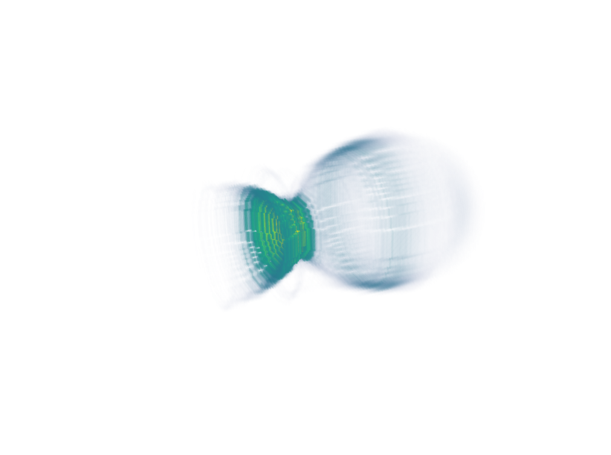

3D visualization using PyVista
===============================

The python package `PyVista <https://github.com/pyvista/pyvista>`_ can
be used to easily produce a 3D visualization of output data. Install PyVista
and openPMD-viewer:

::

  pip install pyvista
  pip install openpmd-viewer

For a simple static visualization, you can use the following code
as an example:

.. code-block:: python

  from openpmd_viewer import OpenPMDTimeSeries
  import pyvista

  # Open the simulation outputs using openPMD viewer
  ts = OpenPMDTimeSeries('./sim_outputs/diags/hdf5')

  # Create the PyVista plotter
  plotter = pyvista.Plotter()
  plotter.set_background("white")

  # Retrieve the rho field from the simulation
  # The theta=None argument constructs a 3D cartesian grid from the cylindrical data
  rho, meta = ts.get_field("rho", iteration=ts.iterations[-1], theta=None)

  # Create the grid on which PyVista can deposit the data
  grid = pyvista.UniformGrid()
  grid.dimensions = rho.shape
  grid.origin = [meta.xmin * 1e6, meta.ymin * 1e6, meta.zmin * 1e6]
  grid.spacing = [meta.dx * 1e6, meta.dy * 1e6, meta.dz * 1e6]
  grid.point_arrays['values'] = -rho.flatten(order='F')

  # Add the grid to the plotter
  # Use a cutoff for rho via the clim argument since otherwise it shows only a small density spike
  plotter.add_volume(grid, clim=(0, 4e6), opacity='sigmoid',
                    cmap='viridis', mapper='gpu', show_scalar_bar=False)

  # A good starting camera position - the three values are the camera position,
  # the camera focus, and the up vector of the viewport
  plotter.camera_position = [(-74, 32, 51), (0, 0, 88), (0, 1, 0)]

  plotter.show()

3D visualization of the simple LWFA example:

