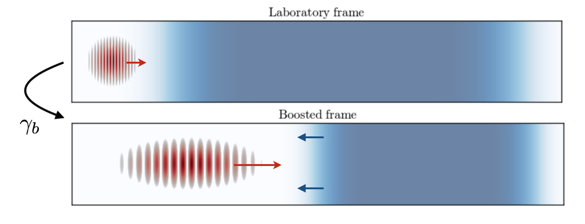

Running boosted-frame simulations
=================================

This page gives a quick overview of **boosted-frame simulations**, a technique
which can speed up certain types of PIC simulations by orders of magnitude.

After explaining the principle of this technique
(in the case of laser-wakefield acceleration, or LWFA), this page discusses
how to handle three important aspects of boosted-frame simulations with FBPIC:

    - Converting the input parameters from the lab frame to the boosted frame
    - Converting simulation results from the boosted frame to the lab frame
    - Avoiding the numerical Cherenkov instability (NCI)

Principle of the boosted-frame technique (for LWFA)
~~~~~~~~~~~~~~~~~~~~~~~~~~~~~~~~~~~~~~~~~~~~~~~~~~~

Instead of running the simulation in the **frame of the laboratory**
(or *lab frame* for short), this technique
consists in running the simulation in a **different Lorentz frame**, which moves
in the same direction as the laser (the *boosted frame*).
The boosted frame is characterized by its Lorentz factor :math:`\gamma_b`.

When performing this Lorentz transformation, the changes in space-time are
computationally favorable:

    - In the boosted frame, the laser is stretched and has a lower frequency.
        This allows the PIC loop to use a larger time step and cell size (in :math:`z`)
        than in the lab frame, while still resolving the laser.
        (More precisely, :math:`\Delta z_{boosted} \approx 2\gamma_b \Delta z_{lab}` and
        :math:`\Delta t_{boosted} \approx 2\gamma_b \Delta t_{lab}`)\

    - In the boosted frame, the plasma is shorter and moves relativistically towards the laser.
        This implies that the time needed for the laser to propagate through
        the plasma is shorter than in the lab frame, and that similarly the simulation will be shorter.

These changes in space-time are represented below.

On the whole (taking into account the longer timestep and shorter propagation time),
the number of required PIC iterations is reduced in the boosted frame:

.. math::

    N_{iterations, boosted} = \frac{1}{2\gamma_{boost}^2} N_{iterations, lab}

which can speed up the simulation by several orders of magnitude.
For more details in the theory of boosted-frame simulations, see the original
paper TODO

.. note::

    In the boosted frame, the plasma has a **higher density**
    (:math:`n_{boosted} = \gamma_b n_{lab}`). Because
    of this, and because of the larger cell size, **each plasma macroparticle typically
    represents more physical particles** in the boosted frame than in the lab frame
    (at least when keeping the same number of macroparticles per cell).
    This implies that simulating e.g. self-injection in the boosted frame will
    result in less macroparticles in the injected beam than in the lab frame,
    and therefore less statistics when evaluating e.g. the beam emittance and charge.

Converting input parameters from the lab frame to the boosted frame
~~~~~~~~~~~~~~~~~~~~~~~~~~~~~~~~~~~~~~~~~~~~~~~~~~~~~~~~~~~~~~~~~~~

When running a simulation in the boosted frame, all the parameters (e.g.
laser wavelength, plasma density, etc.) **needed to be converted** from their known
value in the lab frame to their corresponding value in the boosted frame.

Fortunately, **most methods and classes in FBPIC can perform this conversion
automatically**, so that the user only needs to pass the lab-frame values,
along with the value of :math:`gamma_b`. For instance, the :class:`Simulation` class
will automatically convert the timestep and box size from typical lab-frame values
to the corresponding boosted-frame values.

.. note::

    You still need to provide the number of iterations.

You can see an example in the corresponding script.

Converting simulation results from the boosted frame to the lab frame
~~~~~~~~~~~~~~~~~~~~~~~~~~~~~~~~~~~~~~~~~~~~~~~~~~~~~~~~~~~~~~~~~~~~~

.. note::

    Diagnostics fill from right to left

.. warning::

    If you use the regular diagnostics, then your results will appear directly
    in the boosted-frame.

Avoiding the Numerical Cherenkov Instability (NCI)
~~~~~~~~~~~~~~~~~~~~~~~~~~~~~~~~~~~~~~~~~~~~~~~~~~

TODO: Reference to the NCI papers

.. warning::

    Should not use :math:`c\Delta t_{boosted} > \Delta r` TODO

    This limits the efficiency in the case of PWFA
