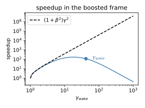
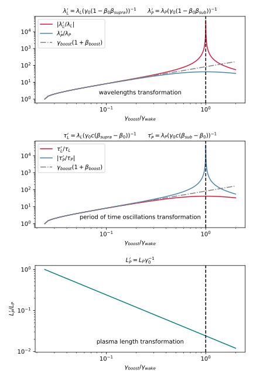
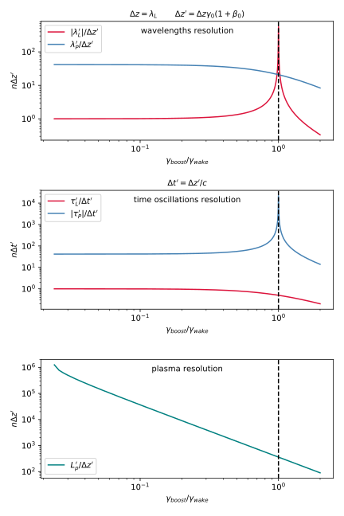

Running boosted-frame simulations
=================================

This page gives a quick overview of **boosted-frame simulations**, a technique
which can speed up certain types of PIC simulations by orders of magnitude.

After explaining the principle of this technique
(in the case of laser-wakefield acceleration, or LWFA), this page discusses
how to handle the most important aspects of boosted-frame simulations with FBPIC:

    - Converting the input parameters from the lab frame to the boosted frame
    - Converting simulation results from the boosted frame to the lab frame
    - Avoiding the numerical Cherenkov instability (NCI)
    - Estimating the number of iterations to use in the boosted frame
    - Understanding the transformation and resolution of physical objects in the boosted frame

Principle of the boosted-frame technique (for LWFA)
~~~~~~~~~~~~~~~~~~~~~~~~~~~~~~~~~~~~~~~~~~~~~~~~~~~

Instead of running the simulation in the **reference frame of the laboratory**
(or *lab frame* for short), this technique
consists in running the simulation in a **different Lorentz frame**, which moves
in the same direction as the laser (the *boosted frame*).
The boosted frame is characterized by its Lorentz factor :math:`\gamma_b`.

When performing this Lorentz transformation, the changes in space-time are
computationally favorable:

    - In the boosted frame, the laser is stretched and has a lower frequency.
        This allows the PIC loop to use a larger time step and cell size (in :math:`z`)
        than in the lab frame, while still resolving the laser.
        (More precisely, :math:`\Delta z_{boosted} \approx 2\gamma_b \Delta z_{lab}` and
        :math:`\Delta t_{boosted} \approx 2\gamma_b \Delta t_{lab}`)\

    - In the boosted frame, the plasma is shorter and moves relativistically towards the laser.
        This implies that the time needed for the laser to propagate through
        the plasma is shorter than in the lab frame, and that similarly the simulation will be shorter.

These changes in space-time are represented below.

.. image:: ../images/Lab_vs_boosted.png

On the whole (taking into account the longer timestep and shorter propagation time),
the number of required PIC iterations is reduced in the boosted frame:

.. math::

    N_{iterations, boosted} \approx \frac{1}{(1+\beta_b)^2 \gamma_b^2} N_{iterations, lab}

which can speed up the simulation by orders of magnitude. However, the above formula is
only an approximation and the calculation of the correct number of timesteps
in practice is discussed below (see :ref:`boosted_frame_speedup`).
Note also that, in theory, the optimal value of :math:`\gamma_b` is
close to :math:`\gamma_{wake}`, i.e. the Lorentz factor
associated with the phase velocity of the plasma wake (group velocity of the laser
pulse in the case of laser-wakefield acceleration). However, for most
simulation setups and due to limits on the spatial and temporal resolution in
the boosted frame in FBPIC, values lower than :math:`\gamma_{wake}` are favorable
(see :ref:`boosted_frame_resolution`).

For more details on the general theory of boosted-frame simulations,
see the `original paper on this technique
<https://journals.aps.org/prl/abstract/10.1103/PhysRevLett.98.130405>`__
or read a `more detailed description of the speedup
<https://aip.scitation.org/doi/pdf/10.1063/1.3663841>`__.

.. note::

    In the boosted frame, the plasma has a **higher density**
    (:math:`n_{boosted} = \gamma_b n_{lab}`). Because
    of this, and because of the larger cell size, **each plasma macroparticle typically
    represents more physical particles** in the boosted frame than in the lab frame
    (at least when keeping the same number of macroparticles per cell).

    This implies that simulating **self-injection** in the boosted frame will
    result in less macroparticles in the injected beam than in the lab frame,
    and therefore **less statistics** when evaluating e.g. the beam emittance and charge.
    In extreme cases (when the number of physical particles per macroparticle is
    comparable to the total number of self-injected particles),
    self-injection may not occur at all in the boosted-frame simulation.

    More generally, for simulations involving injection, it is good practice
    to occasionally compare the results with different :math:`\gamma_b`,
    in order to make sure that the simulation is properly converged.

.. warning::

    In lab-frame simulations, the ions are essentially motionless and the
    current :math:`\boldsymbol{j}` that they produce is negligeable compared to
    that of the electrons. For this reason (and because the PIC algorithm
    essentially only uses the current :math:`\boldsymbol{j}` in order to update the
    fields: see :doc:`../overview/pic_algorithm`), the ions are often omitted from the simulation,
    in order to save computational time. (And in fact, the argument
    ``initialize_ions`` in the :any:`Simulation` object is set to
    ``False`` by default.)

    However, this is no longer valid in boosted-frame simulation, because
    in this case the ions move with relativistic speed and do produce a
    non-negligible current :math:`\boldsymbol{j}`. Therefore, **in boosted-frame
    simulations, the ions are required**. Make sure to include them, either
    by setting the flag ``initialize_ions=True`` in the :any:`Simulation`
    object, or by adding them separately with :any:`add_new_species`.

Converting input parameters from the lab frame to the boosted frame
~~~~~~~~~~~~~~~~~~~~~~~~~~~~~~~~~~~~~~~~~~~~~~~~~~~~~~~~~~~~~~~~~~~

When running a simulation in the boosted frame, all the parameters (e.g.
laser wavelength, plasma density, etc.) **needed to be converted** from their known
value in the lab frame to their corresponding value in the boosted frame.

Fortunately, **most functions and classes in FBPIC can perform this conversion
automatically**, so that the user only needs to pass the lab-frame values,
along with the value of :math:`\gamma_b`. For instance, the :class:`fbpic.main.Simulation` class
will automatically convert the timestep and box size from typical lab-frame values
to the corresponding boosted-frame values.

For each function or class that you use, please look at the corresponding
documentation in the section :doc:`../api_reference/api_reference` to see if it supports
automatic parameter conversion. If it is not the case, you can instead use the
:class:`fbpic.lpa_utils.boosted_frame.BoostConverter`, which implements the Lorentz transform
formulas for the most common physical quantities. Additionally, a function is provided
to automatically estimate the required PIC iterations in the boosted frame (see :ref:`boosted_frame_speedup`).

You can see an example of these different methods for parameter conversion
in the boosted-frame example script of the section :doc:`../how_to_run`.

.. _boosted_frame_lab_diagnostics:

Converting simulation results from the boosted frame to the lab frame
~~~~~~~~~~~~~~~~~~~~~~~~~~~~~~~~~~~~~~~~~~~~~~~~~~~~~~~~~~~~~~~~~~~~~

Although the simulation runs in the boosted frame, it is desirable to have
the results in the lab frame, since this is usually easier to interpret.

FBPIC implements **on-the-fly conversion** of the results,
and can thus output the fields and macroparticles directly
in the lab frame. See the documentation of the classes
:class:`fbpic.openpmd_diag.BackTransformedFieldDiagnostic` and
:class:`fbpic.openpmd_diag.BackTransformedParticleDiagnostic` in order
to use this feature.

.. warning::

    When using the regular classes :class:`fbpic.openpmd_diag.FieldDiagnostic`,
    and :class:`fbpic.openpmd_diag.ParticleDiagnostic`, the corresponding
    diagnostics will contain the fields and macroparticles in the boosted frame.

.. note::

    By default, the converted diagnostics (i.e. in the lab frame) are stored in the
    folder ``lab_diags``, while the raw diagnostics (i.e. in the boosted frame) are
    stored in the folder ``diags``.

    Because of non-simultaneity between Lorentz frames, the files in ``lab_diags``
    will be **filled progressively with data**, from the right-hand side of
    the simulation box to its left-hand side, as the simulation runs.
    If the chosen number of PIC iterations is insufficient, then some of these
    files may be incomplete. (This typically shows up as the fields being zero
    in the left-hand side of the box.)

Avoiding the Numerical Cherenkov Instability (NCI)
~~~~~~~~~~~~~~~~~~~~~~~~~~~~~~~~~~~~~~~~~~~~~~~~~~

When running simulations in the boosted frame, a **numerical instability** (known
as the Numerical Cherenkov Instability, or NCI) can potentially affect the simulation
and degrade its results.

FBPIC suppresses this instability by using the **Galilean technique**. (See
the original papers `here <http://aip.scitation.org/doi/full/10.1063/1.4964770>`__
and `here <https://journals.aps.org/pre/abstract/10.1103/PhysRevE.94.053305>`__
for more information on this technique.) In order to use this suppression algorithm,
the user simply needs to set the argument ``v_comoving`` of the :class:`fbpic.main.Simulation`
class to a velocity close to:

.. math::

    v_{comoving} = -c \sqrt{1 - \frac{1}{\gamma_b^2}}

(Again, see the example in the section :doc:`../how_to_run`)

.. warning::

    The suppression of the NCI is only effective in the case where

    .. math::

        c\Delta t_{boosted} < \Delta r_{boosted}

    or in terms of corresponding lab-frame quantities:

    .. math::

        c\Delta t_{lab} < \frac{\Delta r_{lab}}{2\gamma_b}

    In the case where the above condition is not met, there is, to our
    knowledge, no existing solution to suppress the NCI. Note that FBPIC does
    not check whether the above condition is met in a given simulation ;
    instead the user is responsible for ensuring this.

.. _boosted_frame_speedup:

Estimating the number of PIC iterations for boosted frame simulations
~~~~~~~~~~~~~~~~~~~~~~~~~~~~~~~~~~~~~~~~~~~~~~~~~~~~~~~~~~~~~~~~~~~~~

In order to calculate the required number of timesteps in a boosted frame simulation
in practice, we can calculate and compare the total interaction time of
the physical objects in space. In a lab frame simulation, the total interaction time
:math:`T_{interact}` can be defined as the time needed for the moving window
with length :math:`l_{window}` to cross the plasma with length :math:`L_{plasma}`.

.. math::
    T_{interact} = \frac{L_{plasma} + l_{window}}{v_{window}-v_{plasma}}

Here :math:`v_{window} = \beta_{window}c` is speed of the moving window (which is typically
set to the phase velocity of the plasma wake :math:`\beta_{window} = \beta_{wake}`)
and :math:`v_{plasma} = \beta_{plasma}c` is the speed of the plasma, which would
be :math:`v_{plasma} = 0` in the lab frame.

Consequently, the number of iterations in the lab frame are given by:

.. math::
  N_{lab} = \frac{T_{interact}}{\Delta t}

When using the boosted frame technique, FBPIC will transform all those
quantities into the new frame of reference:

.. math::
  L_{plasma}' = \frac{L_{plasma}}{\gamma}
.. math::
  l_{window}' = l_{window}\gamma(1+\beta)
.. math::
  v_{window}' = c( (\beta_{window}-\beta)/(1-\beta_{window}\beta) )
.. math::
  v_{plasma}' = -\beta c

and using the above formula we can calculate the interaction time in the
boosted frame. The number of required iterations are then given by:

.. math::
  N_{boost} = \frac{T_{interact}'}{\Delta t'}

where :math:`\Delta t' = \gamma (1+\beta) \Delta t` is
the timestep in the boosted frame.

The :any:`BoostConverter` object exposes the above formula for :math:`T_{interact}'`
as function :any:`interaction_time` that can be used to calculate the
required number of timesteps in the boosted frame for a given moving window sliding
across an initially static object with length :math:`L_{interact}` (e.g.
the plasma :math:`L_{interact}=L_{plasma}`). In addition, the timestep in
the boosted frame :math:`\Delta t'` can be accessed through ``sim.dt`` in
FBPIC (see the boosted-frame script in :doc:`../how_to_run`).

The following figure shows the calculation of the expected speedup
(defined as the reduction in the number of PIC iterations, :math:`N_{lab}/N_{boost}`)
of a typical laser-plasma acceleration case. Lets assume a simulation box
(moving window) of length :math:`l_{window} = 100 \, \mu m` interacting with a
plasma of length :math:`L_{plasma} = 12 \, mm`. Assuming a plasma density of
:math:`n_{e}=10^{24} \, m^{-3}`, we set the velocity of the moving window to match
the plasma wake phase velocity, i.e. :math:`\gamma_{wake} \approx 42`.

This simple example highlights two important aspects of choosing the right
:math:`\gamma_b` in practice. First, it can be seen that the speedup does
only follow the simple scaling law :math:`(1+\beta_b)^2\gamma_b^2`
for :math:`\gamma_b \ll \gamma_{wake}`, and second, that the optimum speedup
occurs at a :math:`\gamma_b < \gamma_{wake}` before the simulation
slows down again.

.. note::

    As highlighted in the above example, there is an optimum
    :math:`\gamma_b` for which the interaction time is minimized for a
    given simulation setup. The speed up of a boosted frame
    simulation will reverse for too high values of :math:`\gamma_b`.
    In practice, it is often advisable to fulfil
    :math:`\gamma_b^2 < L_{plasma}/l_{window}` for maximum efficiency and
    :math:`\gamma_b < \gamma_{wake}/2` to properly resolve the physical
    objects (see next section).

.. _boosted_frame_resolution:

Transformation and resolution of physical objects in the boosted frame
~~~~~~~~~~~~~~~~~~~~~~~~~~~~~~~~~~~~~~~~~~~~~~~~~~~~~~~~~~~~~~~~~~~~~~

Although the basic principles of boosted frame simulations have been covered
already in the previous sections, understanding the transformation of
physical quantities in the boosted frame can be more tricky and will be explained
in more detail in the following. We will restrict ourselves to the use case
of laser-plasma acceleration where a simple laser propagates through a homogeneous
plasma.

Fundamentally, the spatial and temporal scales that need to be resolved are
the laser and the plasma wavelength, :math:`\lambda_{l}` and :math:`\lambda_{p}`
(spatial scale), the period of time oscillations of the laser and the plasma
:math:`\tau_{l}` and :math:`\tau_{p}` (temporal scale) and finally the spatial scale
of the plasma itself (:math:`L_{p}`). The following figure shows the normalized
transformation of these quantities for different values of
:math:`\gamma_b` normalized to :math:`\gamma_{wake}`.

For low boosting factors :math:`\gamma_b \ll \gamma_{wake}`,
the spatial and temporal scales of the laser and the plasma will equally increase
:math:`\propto  \gamma_b (1+\beta_b)` and the plasma will contract
as :math:`L_{p} \gamma^{-1}`.

For higher boosting factors, however, the difference in phase velocity between
the laser and the plasma wave becomes apparent in the spatial and temporal scalings.
The laser phase velocity is supra-luminic in plasma
:math:`\beta_{supra} = 1 + n_{e}/(2 n_{c})` compared to the sub-luminic
phase velocity of the plasma wake :math:`\beta_{sub} = 1 - n_{e}/(2 n_{c})`.
Here :math:`n_{c}` is the critical plasma density.

In practice, this discrepancy in the Lorentz transformation of both quantities
can cause diverging spatial and temporal resolutions in the simulation if
:math:`\gamma_b` approaches :math:`\gamma_{wake}`. In FBPIC, the
longitudinal resolution is transformed by default as
:math:`\Delta z'=\Delta z \gamma_b (1+\beta_b)`.
As shown in the next figure, this will cause a decrease in
spatial resolution of the plasma wave, as well as a decrease in temporal
resolution of the laser oscillations, for :math:`\gamma_b \gtrsim \gamma_{wake}/2`.

.. warning::

      As explained in the section above, the spatial and temporal scales of
      the physical objects in the simulation transform differently in the
      boosted frame. Therefore, the relativistic factor of the boosted frame
      should always be much smaller than the plasma wake velocity.
      :math:`\gamma_b < \gamma_{wake}/2` should be satisfied at least
      for a typical laser-plasma acceleration simulation.
