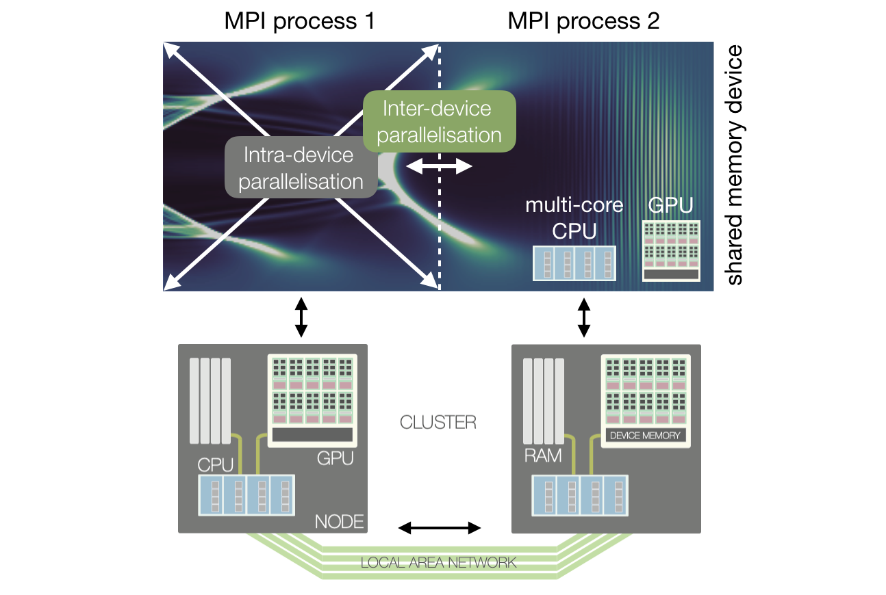

Parallelisation of FBPIC
==================================

This section will give an introduction to the computational two-level
parallelisation of FBPIC. It will explain how FBPIC is parallelised on
many-core hardware, such as a multi-core CPU and GPU, as well as how the
simulation can be split across different devices or compute nodes using the
MPI protocol. Applying the latter parallelisation requires using a variant of
FBPIC's spectral field solver, which is explained in the last section.

Two-level parallelisation
-------------------------

PIC simulations are computationally demanding in terms of arithmetic
operations and memory consumption and are therefore typically parallelised
across many compute units that perform the calculations in parallel.

A common strategy is to spatially decompose the simulation box into multiple
domains corresponding to small parts of the global grid, which are computed in
parallel, while only exchanging the information at the domain boundaries
to ensure globally consistent results. A complementary strategy is to directly
parallelise the PIC methods itself, which is more efficient but requires a
larger amount of information exchange.

The above image shows how FBPIC combines both of these strategies in a
two-level approach depending on the distribution of memory and speed of
communication in modern HPC (High Performance Computing) environments.

Intra-device parallelisation
~~~~~~~~~~~~~~~~~~~~~~~~~~~~

On a first level, a single compute node can consist of one or more multi-core
CPUs or GPUs with each having many computational cores accessing the
same memory. In this **shared memory layout**, the algorithmic PIC methods are
executed on a single such device by many threads in parallel.

Highest efficiency is reached for parallel operations that do not need to
access the same memory locations, such as when updating the individual
particle positions. However, many of the other PIC methods - for example the
spectral transformations - require global communication between threads. In
those cases, the performance is limited by how fast information can be
exchanged across the shared memory.

FBPIC supports both, running on GPUs and CPUs. GPUs are well suited for the
parallel execution of the PIC algorithm, as they can execute thousands of
threads simultaneously, all of which access fast shared memory. In contrast,
only a few parallel threads run efficiently on a CPU, however, each of
them reaches a much higher performance than a single GPU thread.

.. note::

    FBPIC simulations are most accurate and efficient when using only the
    intra-device parallelisation, executing on a single GPU or multi-core CPU.
    The parallel features of FBPIC are only implemented for Intel CPUs and
    Nvidia GPUs (CUDA), using the Numba package. Running on a GPU will
    give the best overall performance. When running on a CPU, highest
    performance is typically achieved using only a single socket with the number
    of threads matching the number of physical cores per socket. In the latter
    case, the user is responsible for setting the correct number of threads
    (see :doc:`../how_to_run`).

Inter-device parallelisation
~~~~~~~~~~~~~~~~~~~~~~~~~~~~

Due to the reduced quasi-3D geometry of FBPIC, the parallelised code typically
executes efficiently on a single device, such as a modern GPU. However, some
cases require scaling to multiple devices or nodes, for instance if the
simulation is larger than the size of the shared memory available or when the
runtime should be reduced further. However, expanding the parallel PIC methods
of the intra-device parallelisation across multiple devices or nodes in a
**distributed memory layout** is inefficient due to the overhead of slower
communication.

.. image:: ../images/domain_decomposition.png

Instead, the simulation box is spatially decomposed into smaller chunks that
are computed in parallel, while exchanging the information of the fields and
particles at the boundaries. As shown in the image above, a guard region is
used as a boundary layer to ensure that fields and particles propagate
correctly from one domain to the other:

  - After each iteration, the electromagnetic fields of a local domain are
    copied to the neighbouring guard region to replace incorrect fields
    at the boundary region.

  - Similarly, the charge and current density are added between overlapping
    domains as if particles would reside in both domains simultaneously.

  - Particles are transferred to the neighbouring domain in regular time
    intervals if they left the local domain.

Although being quite efficient, the parallelisation strategy outlined above
comes at a cost. It requires locality of the simulated physics with information
propagating not farther than the guard region of a domain. This is ensured by
using a tuneable spectral field solver for which the required guard region size
is inversely proportional to its accuracy. Learn more about this in the section
:ref:`finite_order_solver` below.

.. note::

    FBPIC implements spatial domain decomposition only in the longitudinal
    direction (along the Fourier transformed axis). Communication between
    domains occurs via MPI (Message Passing Interface), using the mpi4py
    package. See the section :doc:`../how_to_run` to learn how to start a
    distributed simulation using MPI.

.. warning::

    For standard simulation sizes, efficient scaling of the inter-node
    parallelisation is typically limited to a few (~4-16) domains. Using too
    many domains will result in poor performance, as the size of a single domain
    becomes too small and/or the overhead of communication too large. Please
    also note that the performance achieved in practice can highly depend on
    the quality of the compute environment used.

.. _finite_order_solver:

Finite-order spectral solver
----------------------------

As described in :ref:`this section <spectral_solver>`, the field solver of
FBPIC integrates the Maxwell equations in the frequency domain as opposed
to *standard* field solvers that use finite-differences
to approximate the field evolution. These FDTD (Finite-Difference Time Domain)
solvers are sometimes classified by their *order of accuracy*, which is
characterised by the reach of the finite-difference stencil used in the
calculations. Following this notation, the spectral solver of FBPIC is of
**infinite order** with its stencil extending across the entire simulation
grid. However, the accuracy of the spectral solver can be artificially reduced
to a **finite order**, virtually limiting its reach to a finite range of cells.

Applying the finite-order modification to FBPIC's spectral solver adds the
needed locality to spatially decompose the simulation grid. The required size
of the overlapping guard region between the individual smaller domains is then
governed by the order (accuracy) of the solver.

.. note::

    A lower order requires less guard cells between the domains, therefore
    lowering the overhead from MPI communication. However, it will also decrease
    the accuracy of the field solver. Similar to finite-difference solvers this
    leads to a **spurious numerical dispersion** of the electromagnetic waves,
    potentially causing a deterioration of the beam quality due to **Numerical
    Cherenkov Radiation** (NCR). For common simulation cases of plasma
    acceleration, we recommend using ``n_order=32`` to get accurate results. You can
    learn more about the finite order spectral solver and how to identify NCR
    in a simulation in `this article
    <https://aip.scitation.org/doi/abs/10.1063/1.4978569>`_.

.. warning::

    Although the finite-order spectral solver guarantees locality when advancing
    the electromagnetic fields in time, this is not necessarily true for the
    standard current correction (``curl-free``) of the PIC algorithm. However,
    in practice, this will typically have no negative influence on the
    simulation results. As an alternative, an effectively local current
    correction (``cross-deposition``) can be selected - having the slight
    disadvantage of not strictly preserving a linear laser polarisation.
