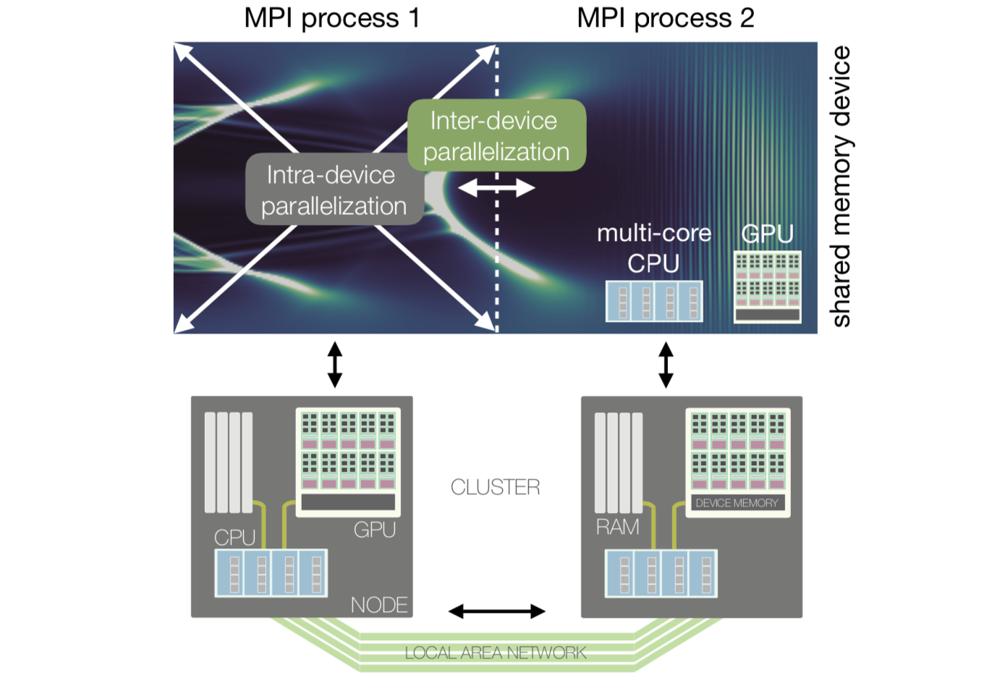
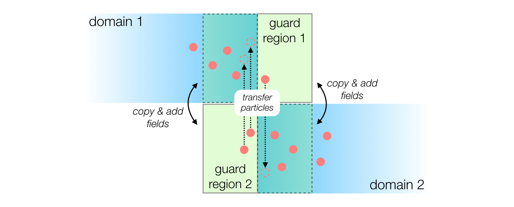

Parallelization of FBPIC
========================

Two-level parallelization
-------------------------

PIC simulations are computationally demanding in terms of arithmetic
operations and memory consumption. Therefore, simulations are typically
**parallelized** across many compute units that share the computational work.

A common parallelization strategy is to spatially decompose the simulation
box into **multiple sub-domains** (i.e. multiple chunks of space):

  - Each sub-domain can be treated by a **separate** computing device
    (e.g. a separate multi-core CPU or GPU). These devices exchange
    a minimal amount of information, at the boundary of the sub-domains,
    using the **MPI** protocol (*inter-device parallelization*).

  - **Within** each sub-domain, the multiple cores of a **single** computing
    device can work together on the same sub-domain, using their
    **shared memory** (*intra-device parallelization*).

The above image illustrates how these two levels of parallelism are mapped
onto a modern HPC (High Performance Computing) architecture. Within one
sub-domain, the multiple cores of a single computing device exchange
large amounts of information via the (fast) shared memory (RAM for CPU, or
device memory for GPU). Between sub-domains, the computing devices exchange
a smaller amount of information via the (relatively slower) local area network.

Intra-device parallelization
~~~~~~~~~~~~~~~~~~~~~~~~~~~~

A single computing device can consist of a multi-core CPU or a GPU. Within
such a device, many computational cores can access the same memory.
In this **shared memory layout**, the algorithmic PIC methods are executed
on a single such device by many threads in parallel.

FBPIC can run either on **CPUs** or on **NVIDIA GPUs**. GPUs are well suited
for the parallel execution of the PIC algorithm, as they can execute thousands
of threads simultaneously. In contrast, only a few parallel threads run
efficiently on a CPU - but each of them has a much higher performance
than a single GPU thread. For typical simulation sizes and modern hardware,
FBPIC is generally much faster on GPU than on CPU.

.. note::

    When running **on a CPU**, the best performance is typically achieved by
    using only a **single CPU socket**, with the number of threads matching
    the number of physical cores per socket. In this case, the user is
    responsible for setting the correct number of threads
    (see :doc:`../how_to_run`).

.. important::

    FBPIC simulations are most efficient when using **only the intra-device
    parallelization**, i.e. executing on a **single** GPU or
    a **single** multi-core CPU.

    This is because using **inter-device parallelization** instead comes
    with overheads (see next section). In general, using multiple GPUs/CPUs
    (with inter-device parallelization) is only advantageous if:

    - The simulation is so large that each PIC iteration takes **more than
      a hundred milliseconds**. (In this case, the inter-device overheads
      become negligible.)

    - The simulation is so large that it **does not fit** in the memory
      of a single computing device.

    Note also that you can still use multiple GPUs/CPUs **without**
    inter-device parallelization, by running **independent** simulations
    in parallel: see :doc:`../advanced/parameter_scans`.

Inter-device parallelization
~~~~~~~~~~~~~~~~~~~~~~~~~~~~

As mentioned above, if the simulation is large enough, it can be advantageous
to use **multiple computing devices** with **inter-device parallelization**.
In this case, the simulation box is split into smaller chunks (sub-domains).
Each computing device handles a separate sub-domain, and they exchange
information on the fields and particles at the boundaries.

As shown in the image below, a guard region is used as a boundary layer to
ensure that fields and particles propagate correctly from one domain to the other:

  - After each iteration, the updated electromagnetic fields of a local
    domain are copied to the neighboring guard region.

  - Similarly, the charge and current density are added between overlapping
    domains as if particles would reside in both domains simultaneously.

  - Particles are transferred to the neighboring domain in regular time
    intervals if they left the local domain.

Note that FBPIC implements spatial domain decomposition **only in the
longitudinal direction** (i.e. the `z` axis).

.. note::

    Communication between domains occurs via MPI (Message Passing Interface),
    using the ``mpi4py`` package.

    - When running on GPUs, FBPIC should use **one MPI process per GPU**.
    - When running on CPUs, FBPIC should use **one MPI process per CPU socket**
      (and one thread per physical core in each socket, as mentioned above).

    See the section :doc:`../how_to_run` to learn how to launch a simulation
    with MPI. You can also pass ``verbose_level=2`` to the :any:`Simulation`
    object to check which CPU/GPU are used by FBPIC.

.. warning::

    For standard simulation sizes, efficient scaling of the inter-node
    parallelization is typically limited to a few (~4-16) domains. Using too
    many domains will result in poor performance, as the size of a single domain
    becomes too small and/or the overhead of communication too large. Please
    also note that the performance achieved in practice can highly depend on
    the HPC architecture used.

Note that the inter-device parallelization strategy also comes with a trade-off.
It requires **locality** of the simulated physics, with information
propagating not farther than the guard region of a domain. This is ensured by
using a **tunable finite-order spectral solver** for which the required
**guard region size** is inversely proportional to the **accuracy of the solver**.

Finite-order spectral solver
----------------------------

As described in :ref:`this section <spectral_solver>`, the field solver of
FBPIC integrates the Maxwell equations in the frequency domain as opposed
to *standard* field solvers that use finite-differences
to approximate the field evolution. These FDTD (Finite-Difference Time Domain)
solvers are sometimes classified by their **order of accuracy**. In an
FDTD solver, the order of accuracy determines the extent of the
finite-difference stencil used in the Maxwell solver.

Following this notation, the *default* spectral solver of FBPIC is of
**infinite order** with its stencil extending across the entire simulation
grid. However, the accuracy of the spectral solver can be artificially reduced
to a **finite order**, virtually limiting the extent of the stencil to a
finite range of cells.

Applying the finite-order modification to FBPIC's spectral solver brings the
locality which is required to spatially decompose the simulation grid.
The required size of the overlapping guard region between the individual
smaller domains is then governed by the order (accuracy) of the solver.

.. note::

    A lower order requires less guard cells between the domains, therefore
    lowering the overhead from MPI communication. However, it will also decrease
    the accuracy of the field solver. Similar to finite-difference solvers this
    leads to a **spurious numerical dispersion** of the electromagnetic waves,
    potentially causing a deterioration of the beam quality due to **Numerical
    Cherenkov Radiation** (NCR). For common simulation cases of plasma
    acceleration, we recommend using ``n_order=32`` to get accurate results.
    You can learn more about the finite order spectral solver and how to
    identify NCR in a simulation in `this article
    <https://aip.scitation.org/doi/abs/10.1063/1.4978569>`_.

.. warning::

    Although the finite-order spectral solver guarantees locality when advancing
    the electromagnetic fields in time, this is not necessarily true for the
    standard current correction (``curl-free``) of the PIC algorithm. However,
    in practice, this will typically have no negative influence on the
    simulation results. As an alternative, an effectively local current
    correction (``cross-deposition``) can be selected - having the slight
    disadvantage of not strictly preserving a linear laser polarization.
