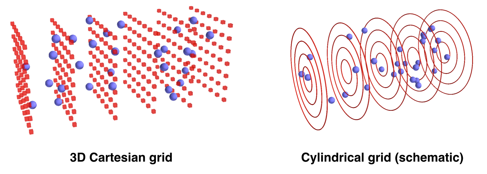
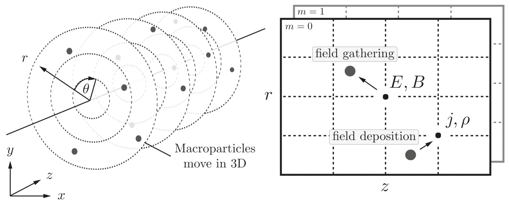

FBPIC algorithm & features
==========================

Introduction to the PIC cycle
--------------------------------

Like any electromagnetic PIC code, FBPIC simulates the
**self-consistent interaction** of **charged particles** and
**electromagnetic fields**.

The charged particles are represented by **macroparticles** (which lump
together several physical particles), while the fields are represented
on a **grid**. The time evolution of the system is simulated by taking **discrete
time steps**. At each timestep:

  - The values of E and B are gathered from the grid onto the macroparticles.
  - The particles are pushed in time.
  - The charge and current of the macroparticles are deposited onto the grid.
  - The fields E and B are pushed in time.

.. image:: ../images/pic_loop.png

The distinctive features of FBPIC
-------------------------------------

Cylindrical grid with azimuthal decomposition
~~~~~~~~~~~~~~~~~~~~~~~~~~~~~~~~~~~~~~~~~~~~~~~~~~

In the *standard* PIC algorithm, the fields are represented on a **3D
Cartesian grid**. This is very generic, but also very computational
expensive. For physical situations that have
close-to-cylindrical symmetry, it is more efficient to use a
**cylindrical grid** for the fields. This is represented below, with
macroparticles in blue and the grid for the fields in red.

The above image is only a schematic view. In fact, instead of using a **3D
Cartesian grid**, FBPIC (and other PIC codes such as `Calder Circ
<http://www.sciencedirect.com/science/article/pii/S0021999108005950>`_)
use **a set of 2D radial grids**, as represented below. Each 2D radial grid represents **an azimuthal mode** (labeled by an integer :math:`m`):

- The grid for :math:`m=0` represents the fields that are **independent of**
  :math:`\theta`. (In idealized laser-wakefield acceleration, this is
  for instance the case for the wakefield.)

- The grid for :math:`m=1` represents the fields that **vary
  proportionally to** :math:`\cos(\theta)` and :math:`\sin(\theta)`. (In
  idealized laser-wakefield acceleration, this is the case of a
  linearly-polarized laser field, when expressed in cylindrical coordinates,
  as :math:`E_r` and :math:`E_{\theta}`.)

- The grids for higher values of :math:`m` represent the fields that
  **vary proportionally to** :math:`\cos(m\theta)` and
  :math:`\sin(m\theta)`. These modes take into account
  further departures from the cylindrical symmetry.

For more details on the cylindrical representation with azimuthal
decomposition, see the `original paper <http://www.sciencedirect.com/science/article/pii/S0021999108005950>`_ of the PIC
code Calder Circ.

.. note::

   The user chooses the number of azimuthal modes used in an FBPIC simulation.
   Thus, you should make sure that you choose **enough modes** to resolve the
   physics at stake (e.g. typically 2 modes for idealized laser-wakefield
   acceleration - although non-linear effects such as self-injection
   may sometimes require 3 modes).

   The fact that only a few 2D grids are used (one per azimuthal mode),
   instead of a full 3D grid, implies that the code uses **vastly less memory**,
   and runs **faster by orders of magnitude** compared to a 3D Cartesian code.
   Nonetheless, the computational cost of an FBPIC simulation does of course
   **increase with the number of azimuthal modes** used.

As suggested in the above image, the macroparticles deposit their
charge and current on each radial grid, and gather the sum of the
fields from each grid.

.. note::

   Due to the details of the algorithm, the charge density deposited on the
   grid, for a **uniform** plasma, may appear to be **slightly non-uniform**
   close to the axis. This non-uniformity decreases when increasing the number
   of particles per cell in the radial direction (``p_nr`` in the function
   :any:`add_new_species`). For more details, see
   `this paper <https://www.sciencedirect.com/science/article/pii/S0021999183710703>`_.

.. note::

   Because of the cylindrical representation, the macroparticles have
   **different weights** (i.e. they represent a different number of
   physical particles): e.g. macroparticles that were initialized far
   from the axis have a larger weight.

   The diagnostics of an FBPIC simulation output the macroparticles
   along with their weights (denoted as `w`) ; be sure to take them into account in
   your post-analysis.

.. _spectral_solver:

Analytical integration in spectral space
~~~~~~~~~~~~~~~~~~~~~~~~~~~~~~~~~~~~~~~~~~~~~

In the *standard* PIC algorithm, for the field solver, the spatial and
time derivatives in the Maxwell equations are discretized using **finite-difference**. However, this can lead to
several important numerical artifacts, including **spurious numerical
dispersion** in the propagation of electromagnetic waves, and
`numerical growth of emittance <http://journals.aps.org/prab/abstract/10.1103/PhysRevSTAB.16.021301>`_ for relativistic beams.

By contrast, FBPIC performs the field solve in **spectral space**,
where the derivatives can be more precisely evaluated, and where
Maxwell's equations can be integrated analytically in time. This can make the
algorithm **dispersion-free in all directions**. For more details
on the algorithm and the artifacts that it avoids, see the `original article
<http://www.sciencedirect.com/science/article/pii/S0010465516300224>`_
of FBPIC (arxiv version `here <https://arxiv.org/abs/1507.04790>`_).

.. note::

  Thanks to the above algorithm, the field solver in
  FBPIC has **no Courant limit**, and thus the timestep :math:`\Delta t` can be
  chosen freely. In practice, it is common to choose :math:`\Delta t =
  \Delta z/c` where :math:`\Delta z` in the resolution along :math:`z`.

This means that, at each timestep, FBPIC transforms the fields to
spectral space, advances them in time, and transforms them back to real
space. Because of the cylindrical geometry, the spectral
transformations consist of a **Fourier transform** along :math:`z`
and a **Hankel transform** along :math:`r`.

.. note::

   While the computational cost of the Fourier transform scales as
   :math:`N_z \log(N_z)`, the cost of the Hankel transform scales as :math:`N_r^2`. Thus, be aware that, when
   using a large number of gridpoints along :math:`r` (:math:`N_r\sim 1000`),
   the Hankel transforms may dominate the computational time.

Centering in time and space
~~~~~~~~~~~~~~~~~~~~~~~~~~~~~~~~~

While, in the *standard* PIC algorithm, the fields are **staggered in
space and time**, in FBPIC the fields are all defined at the **same
points in space** and the **same time** (with the
notable exception of the currents, which are staggered in time).

This allows to avoid **important interpolation artifacts**, which can
produce for instance spurious forces for relativistic electrons
copropagating with a laser (more details in the `original article
<http://www.sciencedirect.com/science/article/pii/S0010465516300224>`_
of FBPIC).
